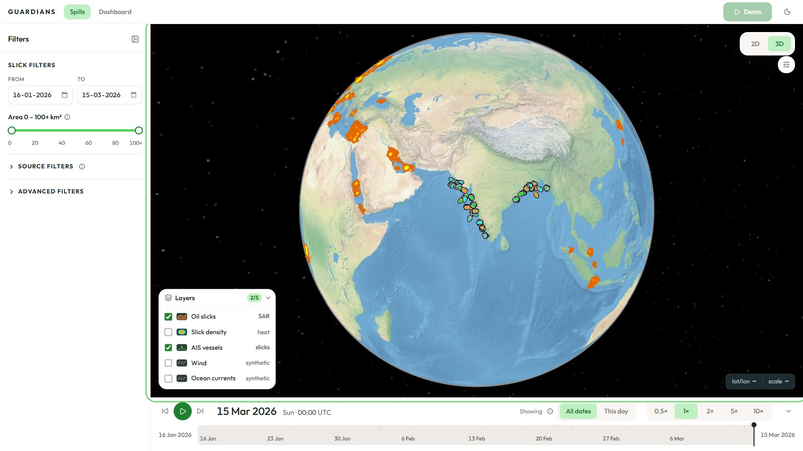
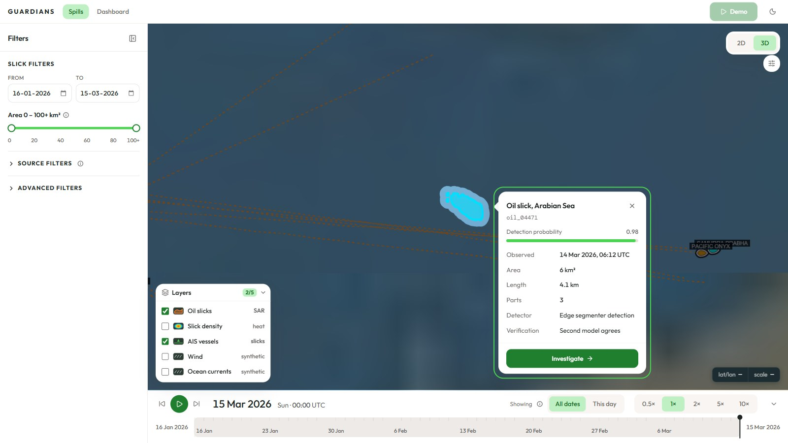
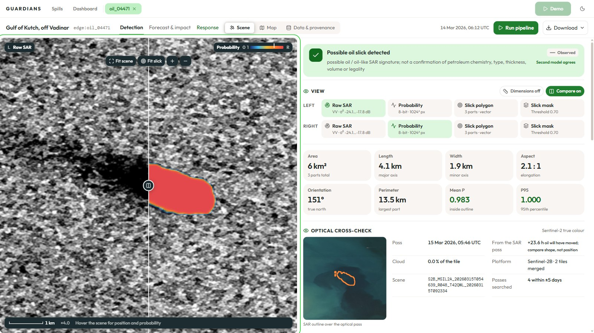
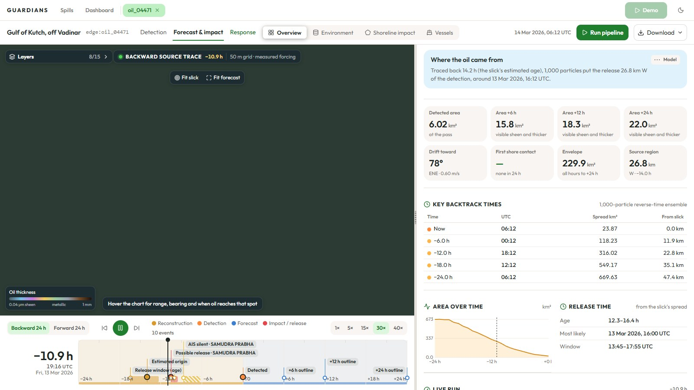
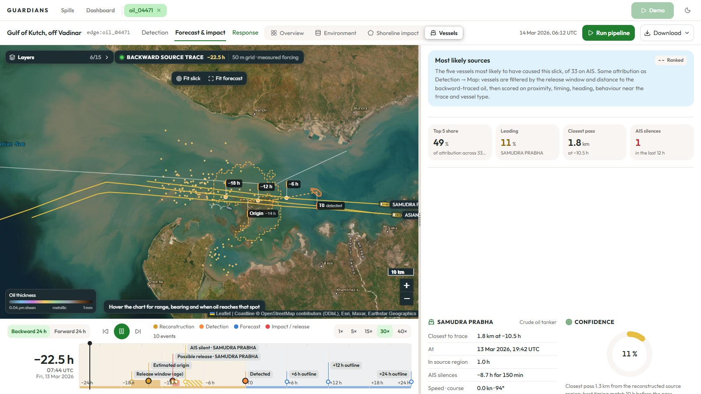
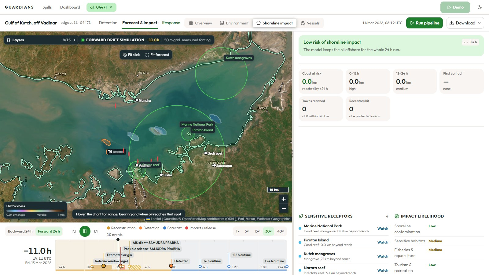
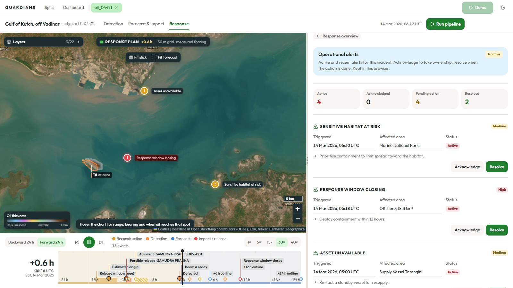
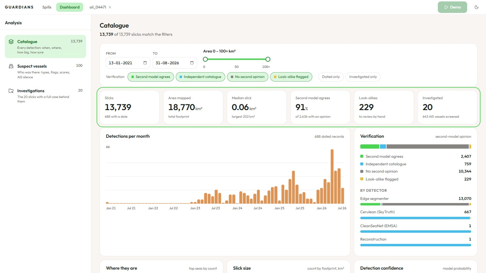
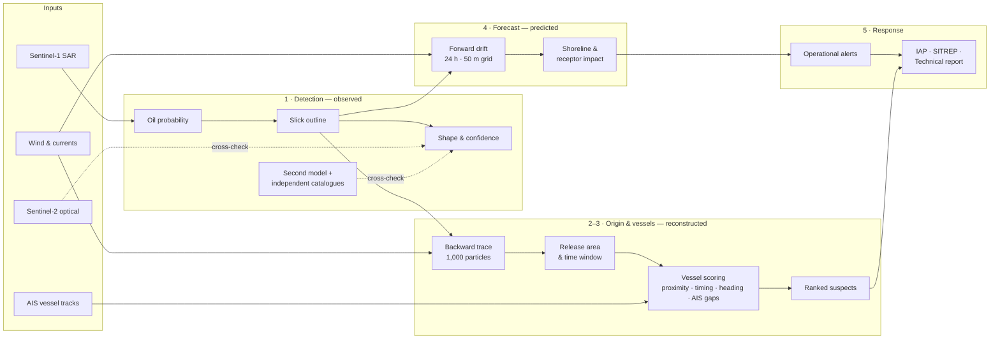

<div align="center">

# GUARDIANS

**From a dark patch on a radar image to a response plan: detect, trace, predict, protect.**

A single evidence pipeline that turns satellite radar and vessel traffic into explainable action against marine oil pollution.

[**▶ Watch the demo video**](https://youtu.be/RsM4zQjXgB8) · [**Open the live app**](https://samratskevents.github.io/sih-guardians/)

[](https://youtu.be/RsM4zQjXgB8)

</div>

---

## The problem

Oil slicks are found late, and whoever released them is rarely held responsible. The evidence is scattered: radar scenes in one system, ship positions (AIS) in another, weather and currents in a third. An analyst has to join them by hand, often after the slick has already drifted, spread or reached the coast.

## What GUARDIANS does

GUARDIANS answers the five questions an investigator actually asks, in order, for every slick:

| # | Question | Stage | What the app shows |
|---|----------|-------|--------------------|
| 1 | **What was actually observed?** | Detection | The Sentinel-1 radar scene, the model's oil probability, shape measurements and an independent second opinion |
| 2 | **Where could it have come from, and when?** | Origin | A 1,000-particle backward trace through wind and currents to the likely release area and time |
| 3 | **Who could be associated with it?** | Vessels | Every AIS track in the release window scored against the traced oil |
| 4 | **Where is it going?** | Forecast | A 24-hour forward drift simulation with the coastline, towns and protected areas in its path |
| 5 | **So what do we do?** | Response | Operational alerts and a response plan, exported as an IAP, SITREP and technical report |

Every result is labelled **Observed**, **Reconstructed** or **Predicted**, so nobody mistakes a model estimate for a measurement.

---

## Walkthrough

### 1. Every slick, on one globe

**13,739 radar-detected oil slicks** from three sources, on an interactive 3D globe (with a flat 2D view too). Filter by date, size, source and verification, and replay detections over time with the timeline.



### 2. One slick, up close

Selecting a slick gives its size, the date of the satellite pass, the detector and how sure the model is. Nearby AIS vessel tracks are drawn alongside. **Investigate** opens the full case.



### 3. Detection: is it oil?

The raw Sentinel-1 SAR scene sits beside the model's oil probability map, with a draggable divider to compare them. Area, length, width, orientation and mean probability are measured from the outline. A **second, independent model** checks the call, and a **Sentinel-2 optical pass** is cross-checked when the sky is clear.



### 4. Origin: where did it come from?

Particles run **backwards in time** through wind and currents. The dashed envelope is where the oil most likely entered the sea. The slick's age is estimated from how far it has spread, which narrows the release to a time window.



### 5. Vessels: who released it?

Every ship in the release window is tested against the traced oil on **proximity, timing, heading and behaviour**, including **AIS silences** (transponders switched off). In the demo case, the crude oil tanker *SAMUDRA PRABHA* leads: it passed 1.8 km from the trace and went AIS-silent for 150 minutes.



### 6. Forecast: where is it going?

Run forward, the drift model shows which towns, mangroves, reefs and marine parks lie in the slick's path, and **when** oil would reach them. The model divides the sea into a 50 m grid, spends effort only where there is oil, and stops the oil at a 1:50m-scale coastline.



### 7. Response: what to do

The forecast becomes a response plan: operational alerts ranked by severity (*sensitive habitat at risk*, *response window closing*, *asset unavailable*), each with an action to acknowledge or resolve. One click exports three documents:

- **Incident Action Plan (IAP)**: objectives, assignments, resources and decision triggers
- **Situation Report (SITREP)**: the current picture for decision-makers
- **Technical report**: the full evidence chain with charts, diagrams and provenance



### 8. The whole catalogue at a glance

The dashboard turns the catalogue into figures: detections per month, verification status, sources, top seas, slick sizes and detection confidence. A second view covers the suspect vessels, and a third lists the investigated cases.



---

## Why it stands out

- **End to end.** Detection, attribution, forecasting and response in one tool, not four.
- **Explainable, not a black box.** Every number traces back to its source on the *Data & provenance* page. Vessel scores are broken down into the factors behind them.
- **Honest about certainty.** Observed, reconstructed and predicted results are labelled apart. Look-alikes (natural films, low wind) are flagged, not hidden.
- **Cross-checked.** A second model, independent catalogues (Cerulean by SkyTruth, CleanSeaNet by EMSA) and Sentinel-2 optical passes check the primary detector.
- **Built for the people who act.** The output is an IAP and SITREP in formats response teams already use, not just a map.
- **Runs in the browser.** Simulations run in Web Workers, off the main thread. The whole app is static files with no backend, so it can be hosted anywhere.

## By the numbers

| | |
|---|---|
| Slicks in the catalogue | **13,739** |
| Total area mapped | **18,770 km²** |
| Detection sources | Edge segmenter, Cerulean (SkyTruth), CleanSeaNet (EMSA) |
| Fully investigated cases | **20** |
| AIS vessels screened | **643** |
| Backtrack ensemble | **1,000 particles**, 24 h |
| Forecast horizon | **24 h**, 50 m grid |
| Generated documents | IAP · SITREP · Technical report (PDF) |

## How it works



| Layer | Technology |
|---|---|
| Interface | React 19, TypeScript, Vite |
| 3D globe | CesiumJS |
| Case maps | Leaflet |
| Drift physics | Thin-film oil model on sparse 64 × 64 blocks that exist only where oil is, run in Web Workers |
| Documents | PDFKit, generated in the browser |
| Guided demo | driver.js |

## Data and scope

This is a working prototype. For transparency:

- **Real data:** the slick catalogue and its outlines, the Sentinel-1 and Sentinel-2 scenes for the flagship case, the Natural Earth basemap and the coastline.
- **Demonstration data:** vessel tracks for most cases, parts of the response plan, and the sea's small-scale eddies (only the mean wind and current come from data). The app labels these wherever they appear, and exported documents carry a **DEMONSTRATION** marking.

---

## Running it locally

Requires Node.js (CI uses version 24).

```bash
npm install      # also copies Cesium's assets into public/cesium
npm run dev      # http://localhost:5199
```

On Windows, `run.bat` installs, starts the server and opens the browser.

| Command | What it does |
|---|---|
| `npm run build` | Type-check and build the static site into `dist/` |
| `npm test` | Check catalogue geometry, near-shore coverage, vessel routes, source-hypothesis selection and the forecast horizon |
| `npm run typecheck` | TypeScript only |

Every push to `main` builds the site and publishes it to GitHub Pages (`.github/workflows`).
